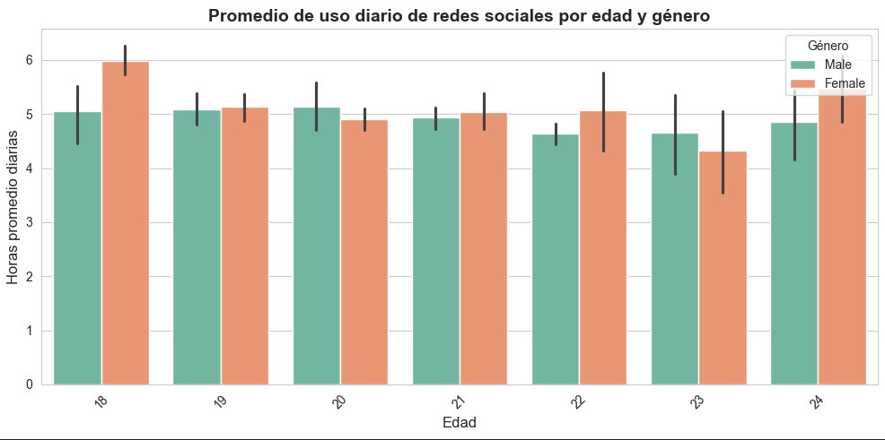
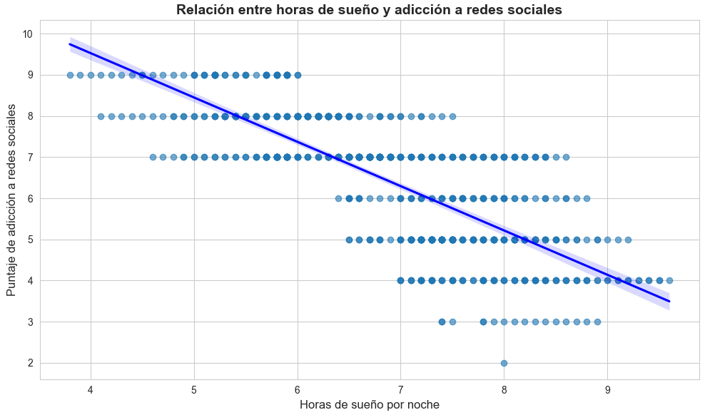
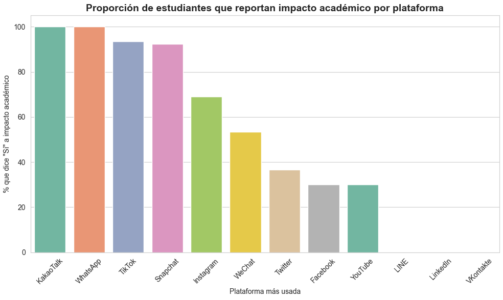
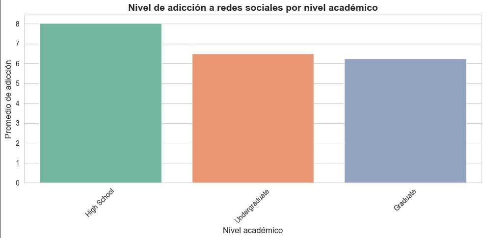
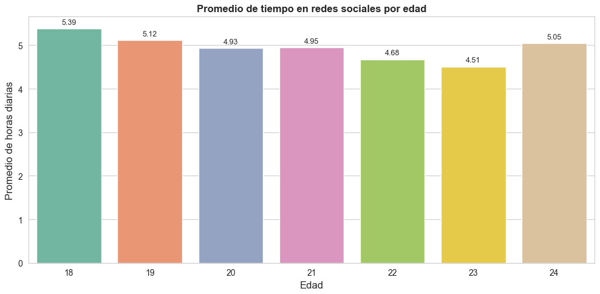
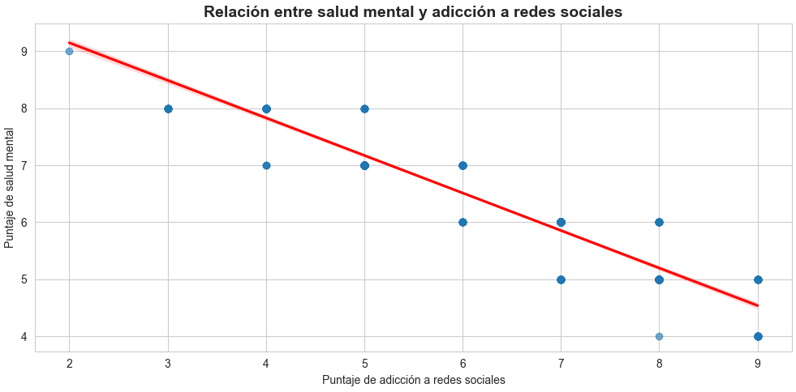

# 📊 Análisis del Impacto de las Redes Sociales en Estudiantes

Este proyecto analiza el uso de redes sociales y su impacto en factores académicos, sociales y de salud mental, con base en datos recopilados de estudiantes de distintos niveles, edades y países.

---

## 📌 Objetivos del análisis

- Explorar el uso diario de redes por edad, género y plataforma.
- Evaluar el impacto académico percibido por el uso de redes.
- Analizar la relación entre adicción, sueño y salud mental.
- Descubrir patrones y diferencias según factores demográficos.

---

## 📈 Análisis realizados

### 1. ¿El uso diario de redes sociales varía por edad y género?

**Gráfico:** Barras agrupadas por género.

**Insight:**  
Se observa que ciertas edades, especialmente entre los 18 y 22 años, muestran un mayor promedio de uso. Las mujeres, en promedio, presentan un uso ligeramente mayor en casi todos los grupos de edad.

---

### 2. Relación entre horas de sueño y adicción a redes

**Gráfico:** Dispersión con regresión lineal.

**Insight:**  
Existe una ligera tendencia negativa: a menor número de horas de sueño por noche, mayor nivel de adicción a redes sociales. Esto sugiere una posible relación entre falta de descanso y uso excesivo.

---

### 3. ¿Qué plataformas afectan más el rendimiento académico?

**Gráfico:** Barras con porcentaje de estudiantes que respondieron "Sí".

**Insight:**  
Plataformas como Kakaotalk e Whatsapp presentan una mayor proporción de estudiantes que indican que afectan negativamente su rendimiento académico, en comparación con otras como LinkedIn o Twitter.

---

### 4. Nivel de adicción por nivel académico

**Gráfico:** Barras simples con valores sobre las barras.

**Insight:**  
Los estudiantes de secundaria muestran los puntajes de adicción más altos, seguidos por los de pregrado. El nivel de adicción disminuye ligeramente en niveles académicos más altos como posgrados.

---

### 5. Horas de uso promedio por edad

**Gráfico:** Barras ordenadas por promedio.

**Insight:**  
Las edades con mayor uso diario de redes se concentran entre los 18 y 20 años, con más de 3 horas al día en promedio.

---

### 6. Relación entre salud mental y adicción

**Gráfico:** Dispersión con línea de regresión.

**Insight:**  
Existe una correlación negativa moderada entre el puntaje de salud mental y el de adicción. A mayor adicción, se observa una tendencia hacia puntuaciones más bajas de salud mental, lo cual puede ser un punto de alerta para intervenciones.

---

## 📦 Herramientas utilizadas

- `Python`
- `Pandas`
- `Seaborn`
- `Matplotlib`
- `Jupyter Notebook`

---

## 📂 Estructura del proyecto

- `timevsage.ipynb`: Notebook con todo el análisis exploratorio.
- `README.md`: Descripción del análisis y hallazgos clave.

---

## 💡 Conclusiones generales

- El uso de redes sociales varía significativamente según edad y género.
- Hay una relación aparente entre adicción, sueño reducido y peor salud mental.
- Algunas plataformas están más asociadas a efectos negativos sobre el rendimiento académico.

---

## 📬 Contacto

_Autor:_ Edward Alejandro Zuluaga Sanchez
_Carrera:_ Ingeniería en Sistemas  
_Correo:_ Edwardalejozuluaga669@gmail.com
